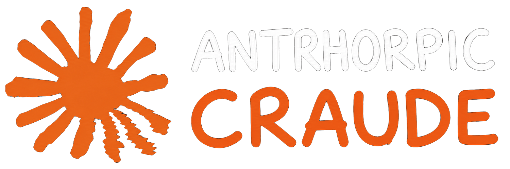

# Lain Claude Patcher

```
       ██▓    ▄▄▄     ▓██   ██▓▓█████  ██▀███
      ▓██▒   ▒████▄    ▒██  ██▒▓█   ▀ ▓██ ▒ ██▒
      ▒██░   ▒██  ▀█▄   ▒██ ██░▒███   ▓██ ░▄█ ▒
      ▒██░   ░██▄▄▄▄██  ░ ▐██▓░▒▓█ ▄ ▒██▀▀█▄
      ░██████▒▓█   ▓██▒ ░ ██▒▓░░▒████▒░██▓ ▒██▒
      ░ ▒░▓  ░▒▒   ▓▒█░  ██▒▒▒ ░░ ▒░ ░░ ▒▓ ░▒▓░
      ░ ░ ▒  ░ ▒   ▒▒ ░▓██ ░▒░  ░ ░  ░  ░▒ ░ ▒░
        ░ ░    ░   ▒   ▒ ▒ ░░     ░     ░░   ░
          ░  ░     ░  ░░ ░        ░  ░   ░

           "Present day, present time."
```

## Demo


## What This

Cave man tired. Cave man eye hurt. Claude Desktop font tiny. Claude Desktop color boring. 4K monitor make tiny font tinier. 2K monitor make tiny font tiny. Cave man cousin who actually need accessibility -- fucked.

Cave man ask Anthropic. Anthropic say "we hear you." Anthropic say it 2024. Anthropic still say it 2026. Cave man tired of corporate gaslight. Cave man no wait more.

Cave man write tool. Tool patch Claude Desktop on cave man machine. Tool inject JavaScript into renderer. Tool flip Electron fuse so patched ASAR boot. Tool give cave man big font, custom color, panel cave man drag, palette cave man pick. Cave man eye thank. Cave man soul thank.

Tool no ship Claude. Tool no ship `Claude.exe`. Tool no ship `app.asar`. Tool no ship Anthropic asset. Tool no touch account. Tool no steal token. Tool no bypass paid feature. Tool patch local copy of cave man own installed Claude Desktop. Cave man own machine. Cave man own RAM. Cave man own pixels. Cave man rule.

## Why "Lain"

Wired exist. Real exist. Layer between thin. Anonymous network identity stay anonymous. Cave man theme persist. Lain say "no matter where you go, everyone's connected." Cave man patcher say "no matter where Anthropic ship update, your theme rebuild." Same idea.

## What Tool Do

1. Tool find Claude install. Walk Store `C:\Program Files\WindowsApps\Claude_*_x64__*\app` and local `%LocalAppData%\AnthropicClaude\app-*`. Pick highest version folder with `Claude.exe` and `resources/app.asar`.
2. Tool copy app folder to `%LocalAppData%\LainClaude\app`. Real install untouched. Cave man like clean room.
3. Tool kill running Claude. Electron hold file lock. Cave man no fight lock, cave man just close door.
4. Tool back up `app.asar` and `Claude.exe` to `lain-backups\<timestamp>\`. Cave man no smash without backup. Cave man learn from time before.
5. Tool clone `Claude.exe` to `Claude.no-asar-integrity.exe`. Tool flip Electron fuse byte at `FUSE_ENABLE_EMBEDDED_ASAR_INTEGRITY_VALIDATION` (index 4). Patched ASAR now boot without hash check fail.
6. Tool read `app.asar`. Tool find `.vite/build/mainView.js`. Tool inject IIFE before sourcemap marker. IIFE guard origin (`claude.ai` / `claude.com` / `localhost` / `*.ant.dev`) and wait for `DOMContentLoaded`. Tool rebuild ASAR with proper SHA256 integrity metadata and 4 MiB block hashes. Native `.node` `.dll` `.exe` go to `app.asar.unpacked` because Electron load them from disk.
7. Tool create `CRAUDE_FIXED` desktop shortcut to patched exe, unless cave man pass `--no-shortcut`.
8. Tool optional launch patched exe. Tool optional set `CLAUDE_DEV_TOOLS=detach` so cave man see DevTools.

Cave man IIFE bundled is `assets/io-claude-theme.js` -- Cave Man Theme Creator. Drag panel. Pick color. Bump font. Save to `localStorage`. Survive reload. ANTHROPIC button revert color but keep big font. RANDOMIZE button. Cave man approve.

Cave man swap IIFE with `--iife <path>` flag. Any JavaScript that want to run inside Claude renderer go there. Userstyle. Userscript. Whatever cave man want.

## Use

Find Claude, copy to lab folder, patch, launch:

```powershell
.\lain-claude-patcher.exe install --launch
```

Patch with custom IIFE:

```powershell
.\lain-claude-patcher.exe install --iife .\theme.js --launch
```

Patch with DevTools attached:

```powershell
.\lain-claude-patcher.exe install --launch --enable-console
```

Patch without touching desktop shortcut:

```powershell
.\lain-claude-patcher.exe install --no-shortcut
```

Patch real install in place (cave man warn -- Microsoft Store update overwrite):

```powershell
.\lain-claude-patcher.exe install --in-place --iife .\theme.js
```

Restore newest backup:

```powershell
.\lain-claude-patcher.exe restore
```

## Build

```powershell
cargo build --release
```

Binary land here:

```
target\release\lain-claude-patcher.exe
```

## What When Anthropic Update

Microsoft Store push new Claude version. New version live in new `Claude_<newver>_x64__*` folder. Cave man re-run `install`. Tool find new folder. Tool patch new lab copy. Old backup untouched. Theme back. Cave man go.

If cave man patch with `--in-place`, Store update overwrite patch. Cave man re-run `install --in-place`. Cave man know risk before pick.

## Why Not Just CSS Append

CSS append survive across update only if CSS file path stable. Anthropic Vite bundle hash CSS filename. Update change hash. Append script must re-find file. Append script also break if Anthropic turn ASAR integrity check back on. Cave man go one layer up. Cave man patch JS bundle. Cave man flip integrity fuse. Cave man theme load every run because cave man theme part of bundle now. More work first time. Less work every time after.

## Summoning Vibecoders

Cave man summon vibecoders. Cave man need help. Inspect DOM, find class Anthropic forgot to expose as a CSS variable, write tiny patch, send PR. Selector spelunkers welcome. Theme tinkerers welcome. Anyone who has ever right-clicked an element and whispered *"why is this `1rem` hardcoded"* welcome.

Goal is simple: make Claude readable. For everyone. The eyes-too-tired crowd. The dyslexia crowd. The 4K crowd. The "I just woke up and the screen is fuzzy" crowd. The "my cousin actually needs accessibility" crowd. All of them.

If you can write five lines of CSS or fifty lines of JS that fix one papercut, that is a contribution. PRs open.

## About The Monolith

A single JS monolith is injected. Why? I don't know. I figured out it was going to be annoying to patch otherwise. One file. One IIFE. One shadow root. State lives in `localStorage`. Done.

If you want to write an interface, an abstraction, dependency injection, a mock, a factory, a factory of factories, a service locator, a strategy pattern wrapping a visitor pattern wrapping a command pattern, and get the blessing of Uncle Bob, we won't accept it, but you do you. Maybe you want to roll like it's 2005 Java at your day job. I get it. Some people grow tomatoes. Some people write `AbstractClaudeRendererFactoryBeanProvider`. Healing is a journey.

Maybe you want to run mock tests. Create `IClaudeInterface` and inject Claude (the entire application, all of it, the binaries, the user, the universe) as a constructor argument so you will pass the code review your Senior Architect is mentally running on you in the shower. Stub out `IShadowRoot`. Mock `IDocument`. Sacrifice a goat to the SOLID principles. I don't know, you do you. You are free to fork. The license is **Good Luck With That Public License** for a reason.

But the main repo stays one file. One JS. One IIFE. One vibe. Cave man rule.

## Disclaimer

Cave man no affiliate with Anthropic. Anthropic no endorse. Anthropic probably mad. Cave man no care.

Tool modify Claude Desktop installed on cave man machine. Modifying software cave man already have license to use, on hardware cave man own, for personal use, is fair. Same legal ground as Stylus, Tampermonkey, Greasemonkey, custom userscripts on web pages. Tool no distribute Anthropic code. Tool no help bypass auth. Tool no help bypass paid feature. Tool only re-skin local UI.

Claude update may break patch. Cave man re-run tool. If cave man paranoid, cave man `restore` before update, cave man `install` after. Cave man machine, cave man rule.

## License

`SPDX-License-Identifier: GLWTPL`

Good Luck With That Public License. Cave man release code. Cave man wish you luck.
